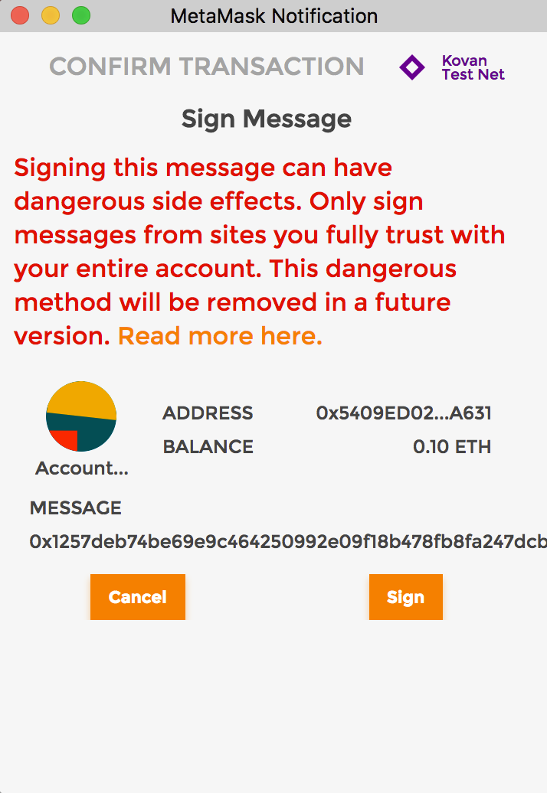
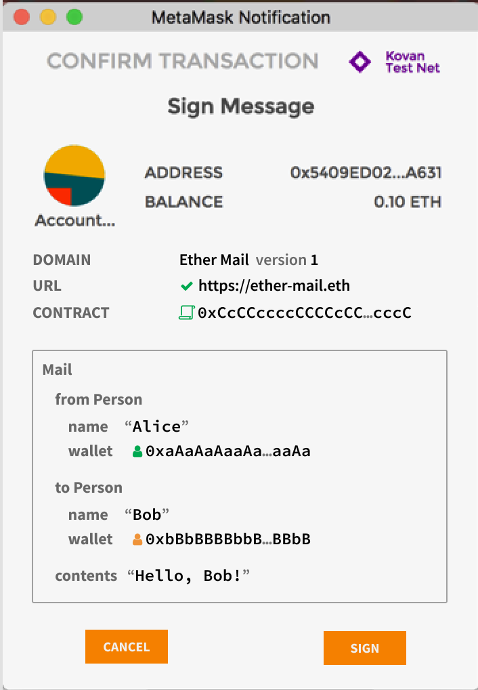

# 1. EIP712란?

---

EIP-712은 이더리움에서 구조화된 데이터에 대한 서명 표준을 제공하기 위해 만들어졌다.

구조화된 데이터에 서명을 함으로써 사용자가 서명 전 어떤 데이터에 서명하는지 읽을 수 있게 된다.

이는 16진수 문자열에 서명하던 기존의 서명 방식보다 사용자 친화적이다.

또한 서비스명이나 버전, URL, 컨트랙트 주소 등 도메인 관련 속성들을 지정, 제한하여 보안성 또한 향상시킨다.

이러한 도메인 관련 속성들은 서명 화면에서도 확인할 수 있다.

1. **서명의 컨텍스트 식별**:

   서명이 어떤 스마트 컨트랙트, DApp, 또는 특정 이더리움 네트워크 내에서 발생하고 있는지를 명확히 합니다.

   이는 서명이 특정한 환경 또는 애플리케이션에 한정되어 있음을 나타냅니다.

2. **서명의 안전성 향상**:

   서명이 특정 도메인에 한정되어 있다는 것을 명확히 함으로써, 서명의 오용이나 재사용을 방지합니다.

   예를 들어, 한 DApp에서 사용된 서명이 다른 컨텍스트나 DApp에서 재사용되는 것을 막을 수 있습니다.

3. **사용자 경험 개선**:

   사용자가 서명하는 데이터와 그 컨텍스트를 더 잘 이해할 수 있도록 하여, 사용자가 무엇에 서명하는지,

   그리고 그 서명이 어떤 영향을 미칠지 명확하게 인지할 수 있도록 합니다.

[EIP-712: Typed structured data hashing and signing](https://eips.ethereum.org/EIPS/eip-712)

기존 서명



EIP-712가 적용된 서명



# 2. EIP712 세 가지 인코딩 방식

---

EIP-712에는 각기 다른 상황과 데이터 유형에 적용되는 세 가지 주요 인코딩 방식이 있다.

## 2-1. **트랜잭션 인코딩**

일반적인 이더리움 트랜잭션에 사용.

```solidity
encode(transaction : 𝕋) = RLP_encode(transaction)
```

- **`RLP_encode(transaction)`**은 트랜잭션 데이터 구조를 효율적으로 인코딩하는 데 사용된다.
- **`RLP_encode`()는 어디서 확인??**

## 2-2. **일반 메시지 인코딩**

이 방식은 일반 텍스트 메시지 또는 데이터에 대한 서명을 생성할 때 사용된다.

메시지가 사용자에 의해 의도적으로 서명되었음을 나타내며, 일반 트랜잭션과 구분된다.

```solidity
// 일반 메시지에 서명할 때 사용되는 표준 형식
encode(message : 𝔹⁸ⁿ) = "\\x19Ethereum Signed Message:\\n" ‖ len(message) ‖ message
```

> **`𝔹⁸ⁿ`**에서 **`𝔹`**는 이진수(0과 1)를 의미, **`⁸`**는 8비트(1바이트)를 의미. **`ⁿ`**은 n개의 요소. 따라서, **`𝔹⁸ⁿ`**은 n개의 바이트로 구성된 데이터 집합을 의미. 일반적으로 문자열, 파일, 네트워크 패킷 등 다양한 형태의 디지털 데이터를 표현하는 데 사용. 예를 들어, 텍스트 문자열이나 이더리움 트랜잭션의 원시 데이터는 **`𝔹⁸ⁿ`** 형식으로 표현될 수 있음

- **`‖`** 기호는 세 개의 구성 요소를 하나의 연속된 데이터 스트림으로 결합한다는 것을 의미
- **`"\x19Ethereum Signed Message:\n"`** 는 이더리움에서 메시지를 서명할 때 사용되는 고정된 접두사
- **`\x19`**문자는 "Device Control 1 (DC1)"로도 알려져 있으며, 특정 장비를 제어하는 데 사용되었던 역사적인 배경을 가지고 있다. 하지만 현대 컴퓨팅에서는 이러한 구체적인 제어 기능보다는 데이터의 시작이나 끝을 표시하는 데 사용될 수 있다. 여기서는 이더리움 서명의 시작을 표시한다. (’\’가 두 개인 이유는 이스케이프 용도)
- **`len(message)`**는 메시지의 길이를 나타낸다.
- **`message`**는 실제 서명할 메시지 내용

## 2-3. **도메인 분리 인코딩 (encode(domainSeparator : 𝔹²⁵⁶, message : 𝕊))** eth_signTypedData

EIP-712의 핵심 부분으로, 구조화된 데이터에 대한 서명을 생성할 때 사용된다.

```solidity
// **𝔹²⁵⁶**은 256비트의 이진 데이터
encode(domainSeparator : 𝔹²⁵⁶, message : 𝕊) = "\\x19\\x01" ‖ domainSeparator ‖ hashStruct(message)
```

이 도메인 분리 인코딩은 오픈제플린의 ECDSA.sol 라이브러리의 toTypedDataHash()함수를 사용할 수 있다. (ECDSA.sol 참고: https://velog.io/@choyeah/ECDSA.sol)

```solidity
// @openzeppelin/contracts/utils/cryptography/ECDSA.sol

/**
 * @dev Returns an Ethereum Signed Typed Data, created from a
 * `domainSeparator` and a `structHash`. This produces hash corresponding
 * to the one signed with the
 * https://eips.ethereum.org/EIPS/eip-712[`eth_signTypedData`]
 * JSON-RPC method as part of EIP-712.
 *
 * See {recover}.
 */
function toTypedDataHash(bytes32 domainSeparator, bytes32 structHash) internal pure returns (bytes32) {
    return keccak256(abi.encodePacked("\x19\x01", domainSeparator, structHash));
}
```

오픈제플린 eip712 컨트랙트에 구현되어있는 sign() 함수를 사용할 수 도 있다.

```solidity
sign(keccak256("\x19\x01" ‖ domainSeparator ‖ hashStruct(message)))
```

### 2-3-1 **"\x19\x01"**

**`"\x19\x01"`**는 구조화된 데이터에 대한 서명을 나타내는 특별한 접두사이다.

### 2-3-2 **domainSeparator 란?**

**`domainSeparator`**는 서명이 발생하는 특정 '도메인'(특정 스마트 컨트랙트 또는 DApp)을 식별하기 위한 목적의 도메인 시그니처라고 볼 수 있다.

자신의 컨트랙트 주소, 체인아이디, 도메인명, 버전 정보 등 도메인을 특정할 수 있는 요소들을 해시한 값이다.

이 값은 서명 프로세스에서 사용되어, 서명 데이터가 특정 도메인과 관련이 있음을 나타낸다.

아래는 오픈 제플린 EIP712 컨트랙트에서 **domainSeparator를 생성하는 함수 구현 코드이다.**

```solidity
function _buildDomainSeparator(
    bytes32 typeHash,
    bytes32 nameHash,
    bytes32 versionHash
) private view returns (bytes32) {
    return keccak256(abi.encode(typeHash, nameHash, versionHash, block.chainid, address(this)));
}
```

해시 대상으로 **2)name(도메인명), 3)version** 정보가 해시되어 사용되고,

컨트랙트 상에서 추출한 **4)체인 아이디**와 현재 자기 **자신의 5)컨트랙트 주소 그리고 1)typeHash가 있다.**

### 2-3-3 typeHash

```solidity
bytes32 constant MAIL_TYPEHASH = keccak256("Mail(address from,address to,string contents)");
```

**typeHash의 개념은** 메시지 구조체를 특정하는 해시값이라고 볼 수 있다.

**메시지로 사용하는 구조체의 이름과 항목들의 타입과 항목명을 keccak256() 함수로 해시한 값이다.**

> typeHash는 다음 항목에서 알아볼 hashStruct() 내부에서 사용된다.

아래는 커스텀 메세지 구조체를 기반으로 타입 해시를 만드는 코드 예이다.

```solidity
contract MyEIP712 is EIP712 {
    bytes32 public immutable _MESSAGE_TYPEHASH = keccak256("Message(address from,address to,string data)");
    struct Message {
        address from;
        address to;
        string data;
    }
.
.
.
```

### 2-3-4 **hashStruct()**

**`hashStruct(message)`**는 구조화된 메세지를 해싱한 데이터를 의미한다.

```solidity
function hashStruct(Mail memory mail) pure returns (bytes32 hash) {
    return keccak256(abi.encode(
        MAIL_TYPEHASH,
        mail.from,
        mail.to,
        keccak256(mail.contents) // <-- 해싱되는 항목의 타입이 스트링 타입일 경우 꼭 해시함수를 적용시켜야한다.
    ));
}
```

> hashStruct()에서 해싱되는 항목의 타입이 스트링 타입일 경우 꼭 해시함수를 적용시켜야한다.

# 3. EIP712 컨트랙트 살펴보기

---

오픈제플린에서 구현된 712 컨트랙트를 기반으로 살펴보자, 오픈제플린 EIP712는 이미 오딧을 마친 컨트랙트 이므로 보다 쉽고 안전하게 구현할 수 있다.

전체코드: https://github.com/OpenZeppelin/openzeppelin-contracts/blob/master/contracts/utils/cryptography/EIP712.sol

## 3-1 멤버 변수

```solidity
// Cache the domain separator as an immutable value, but also store the chain id that it corresponds to, in order to
// invalidate the cached domain separator if the chain id changes.

//EIP712 규격에 명시된 형태로 메세지를 만들기 위해 정의해둔 변수들
bytes32 private immutable _CACHED_DOMAIN_SEPARATOR; // 도메인을 특정하는 해시값
uint256 private immutable _CACHED_CHAIN_ID; // 체인 아이디
address private immutable _CACHED_THIS; // 현재 컨트랙트 주소

// 네임과 버전은 메타마스크와 같은 사용자 지갑에서 보여지는 항목이다
bytes32 private immutable _HASHED_NAME;
bytes32 private immutable _HASHED_VERSION;

bytes32 private immutable _TYPE_HASH; // 메세지 구조체를 특정하는 해시값
```

## 3-2 생성자

```solidity
/**
 * @dev Initializes the domain separator and parameter caches.
 *
 * The meaning of `name` and `version` is specified in
 * <https://eips.ethereum.org/EIPS/eip-712#definition-of-domainseparator>[EIP 712]:
 *
 * - `name`: the user readable name of the signing domain, i.e. the name of the DApp or the protocol.
 * - `version`: the current major version of the signing domain.
 *
 * NOTE: These parameters cannot be changed except through a xref:learn::upgrading-smart-contracts.adoc[smart
 * contract upgrade].
 */
constructor(string memory name, string memory version) {
    bytes32 hashedName = keccak256(bytes(name));
    bytes32 hashedVersion = keccak256(bytes(version));
    bytes32 typeHash = keccak256(
        "EIP712Domain(string name,string version,uint256 chainId,address verifyingContract)"
    );
    _HASHED_NAME = hashedName;
    _HASHED_VERSION = hashedVersion;
    _CACHED_CHAIN_ID = block.chainid;
    _CACHED_DOMAIN_SEPARATOR = _buildDomainSeparator(typeHash, hashedName, hashedVersion);
    _CACHED_THIS = address(this);
    _TYPE_HASH = typeHash;
}
```

## 3-3 주요 함수

```solidity
/**
 * @dev Returns the domain separator for the current chain.
 */
function _domainSeparatorV4() internal view returns (bytes32) {
    // 이미 계산된 _CACHED_DOMAIN_SEPARATOR를 사용합니다. 이는 가스 비용을 절약하기 위해 도메인 구분자를 매번 계산하지 않고 저장된 값을 재사용합니다.
    if (address(this) == _CACHED_THIS && block.chainid == _CACHED_CHAIN_ID) {
        return _CACHED_DOMAIN_SEPARATOR;
    } else {
       // 프록시 컨트랙트를 경유할때 else문을 탈 수 있음
       return _buildDomainSeparator(_TYPE_HASH, _HASHED_NAME, _HASHED_VERSION);
    }
}
```

```solidity
function _buildDomainSeparator(
    bytes32 typeHash,
    bytes32 nameHash,
    bytes32 versionHash
) private view returns (bytes32) {
    return keccak256(abi.encode(typeHash, nameHash, versionHash, block.chainid, address(this)));
}
```

````solidity
/**
 * @dev Given an already <https://eips.ethereum.org/EIPS/eip-712#definition-of-hashstruct>[hashed struct], this
 * function returns the hash of the fully encoded EIP712 message for this domain.
 *
 * This hash can be used together with {ECDSA-recover} to obtain the signer of a message. For example:
 *
 * ```solidity
 * bytes32 digest = _hashTypedDataV4(keccak256(abi.encode(
 *     keccak256("Mail(address to,string contents)"),
 *     mailTo,
 *     keccak256(bytes(mailContents))
 * )));
 * address signer = ECDSA.recover(digest, signature);
 * ```
 */
function _hashTypedDataV4(bytes32 structHash) internal view virtual returns (bytes32) {
    return ECDSA.toTypedDataHash(_domainSeparatorV4(), structHash);
}
````

\_hashTypedDataV4()는 ECDSA 라이브러리의 toTypedDataHash()를 사용하는데 아래 코드의 내용과 같이 ***도메인 분리 인코딩*을 규격에 맞게 만들어 리턴 시켜준다.**

```solidity
function toTypedDataHash(bytes32 domainSeparator, bytes32 structHash) internal pure returns (bytes32) {
    return keccak256(abi.encodePacked("\x19\x01", domainSeparator, structHash));
}
```

# 4. EIP712 컨트랙트 구현코드 살펴보기

---

- 메시지 구조체와 타입해시 부분을 정의해준다.
- 생성자에 부모 컨트랙트 인자(네임, 버젼) 넘겨주기
- validateSigner()는 외부에서 조회할 수 있도록 구현
  - ECDSA.recover()의 인자로 메세지 시그니쳐와 함께, \_hashTypedDataV4(structHash)를 넘겨줌을 확인하자
- hashStruct()는 내가 정의한 메세지 구조에 맞게 구현
  - **스트링 데이터는 꼭 abi.encodePacked() 후 keccak256()까지 해줘야한다.**
- 나머지 함수는 부모 컨트랙트 함수 이용

```jsx
// SPDX-License-Identifier: MIT
pragma solidity ^0.8.13;
import "@openzeppelin/contracts/utils/cryptography/EIP712.sol";

contract MyEIP712 is EIP712 {
    bytes32 public immutable _MESSAGE_TYPEHASH =
        keccak256("Message(address from,address to,string data)");
    struct Message {
        address from;
        address to;
        string data;
    }

    constructor() EIP712("MyEIP712", "1") {}

    function domainSeparatorV4() public view returns (bytes32) {
        return _domainSeparatorV4();
    }

    function hashTypedDataV4(bytes32 structHash) public view returns (bytes32) {
        return _hashTypedDataV4(structHash);
    }

    //validating Signer
    function validateSigner(
        bytes32 structHash,
        bytes memory signature
    ) public view returns (address) {
        return ECDSA.recover(_hashTypedDataV4(structHash), signature);
    }

    //make hash struct of the order
    function hashStruct(Message memory message) public view returns (bytes32) {
        return
            keccak256(
                abi.encode(
                    _MESSAGE_TYPEHASH,
                    message.from,
                    message.to,
                    keccak256(abi.encodePacked(message.data))
                )
            );
    }
}
```

# 5. HARDHAT 테스트 코드 흐름 살펴보기 (tutorial_hardhat/test/EIP712ContractTest.ts)

---

- tutorial_hardhat 디렉터리에서 npm install
- tutorial_hardhat/.env 셋팅

## 5-1. 메세지 구조체를 해싱

```jsx
structuredMessage = {
  from: owner.address,
  to: address1.address,
  data: "some data here",
};
const structHash = await deployedEIP712.hashStruct(structuredMessage);
console.log("hash sturct is : ", structHash);
// hashed sturct is :  0xcc5c73c605458eb2badcb49f8d27819643884510f8309664a883671f1c6e70e9
```

## 5-2. 도메인 분리 방식 인코딩

메세지 구조체 해시값을 인자로 하여 도메인 분리 방식으로 인코딩(해시)

```jsx
const hashTypedDataV4Res = await deployedEIP712.hashTypedDataV4(structHash);
console.log("hashTypedDataV4Res >>", hashTypedDataV4Res);
// hashTypedDataV4Res >> 0x9619176a0725dd9797bf9790397fad26fff3af431afb6db01ae2f10fe882b47e
```

## 5-3. 유저의 시그니쳐 가져오기

Ethers.js 의 \_signTypedData()를 사용하여 메세지 구조체를 서명한다.

```jsx
const network = await ethers.provider.getNetwork();
const chainId = network.chainId;

// 메타마스크에서 사용되는
const msgParams = {
  domain: {
    // Give a user friendly name to the specific contract you are signing for.
    name: "MyEIP712", // 메타마스크에 표시되는 컨트렉트 이름, 예를들어 0000거래소
    // Just let's you know the latest version. Definitely make sure the field name is correct.
    version: "1", // 눈에 보이는 명시하는 버전
    // Defining the chain aka Rinkeby testnet or Ethereum Main Net
    chainId: ethers.BigNumber.from(chainId),
    // If name isn't enough add verifying contract to make sure you are establishing contracts with the proper entity
    verifyingContract: deployedEIP712.address, // 사인을 하는 컨트렉트의 주소, 0000거래소의 CA
  },

  // Defining the message signing data content.
  message: {
    /*
    - Anything you want. Just a JSON Blob that encodes the data you want to send
    - No required fields
    - This is DApp Specific
    - Be as explicit as possible when building out the message schema.
    */
    from: owner.address,
    to: address1.address,
    data: "some data here",
  },
  // Refers to the keys of the *types* object below.
  primaryType: "Message",
  types: {
    Message: [
      { name: "from", type: "address" },
      { name: "to", type: "address" },
      { name: "data", type: "string" },
    ],
  },
}; // end of msgParams

let signature = await owner._signTypedData(
  msgParams.domain,
  msgParams.types,
  msgParams.message
);
console.log("signature is : ", signature);
// signature is :  0x1464f2079b479e4d57e8f9980ea9abc17c447c742543f4d18d8caea1b0b5bd6e3e0f41e0b9e4e399468aae2c4b88782674c60adde9330fd0ea918045fd3fa5341c
```

## 5-4. 검증

- ethers.js verifyTypedData()를 사용하여 검증:
  메세지를 서명한값과 메세지 정보를 통해 서명자의 공개키를 얻고 서명한 지갑의 퍼블릭키와 동일한지 확인한다.
- 컨트랙트 함수 validateSigner()를 사용하여 검증:
  통해서도 structHash, signature을 인자로 제공하여 서명자의 지갑주소를 리턴 받을 수 있다.

```jsx
const verifiedAddress = ethers.utils.verifyTypedData(
  msgParams.domain,
  msgParams.types,
  msgParams.message,
  signature
);
expect(verifiedAddress).to.equal(owner.address);
console.log("verifiedAddress from ethers is : ", verifiedAddress);
// verifiedAddress from ethers is :  0xf39Fd6e51aad88F6F4ce6aB8827279cffFb92266

const recoveredSigner = await deployedEIP712.validateSigner(
  structHash,
  signature
);
expect(recoveredSigner).to.equal(owner.address);
console.log("recoveredSigner from contract is : ", recoveredSigner);
// recoveredSigner from contract is :  0xf39Fd6e51aad88F6F4ce6aB8827279cffFb92266
```

# 6. 메타마스크 테스트

---

- metmaskExpress 디렉터리에서 npm install
- metmaskExpress/views/index.ejs 코드에서 체인아이디, 배포된 712 컨트랙트 주소 붙여넣기
- npm run으로 테스트 코드 실행
- 메타마스크 sign-typed-data-v4 참고:
  - https://docs.metamask.io/wallet/how-to/sign-data/#sign-typed-data-v4
  - https://docs.metamask.io/wallet/reference/eth_signtypeddata_v4/

# 7. UseCase

---

## 7-1. EIP-2612(Permit)

'permit'은 ERC-20 토큰 표준에 확장 기능으로 [EIP-2612](https://eips.ethereum.org/EIPS/eip-2612)에서 제안되었다.

퍼밋(permit) 메커니즘은 기존 ERC-20 토큰의 'approve' 및 'transferFrom' 과정을 하나의 트랜잭션으로 간소화한다.

전통적인 ERC-20 토큰에서 토큰을 전송하려면 먼저 'approve'를 호출하여 토큰을 사용할 권한을 부여한 후, 'transferFrom'을 호출해야 한다.

이는 두 번의 트랜잭션과 가스 비용을 필요로 한다.

반면 퍼밋 메커니즘은 사용자가 단일 트랜잭션으로 이러한 과정을 수행할 수 있게 해주는데, 사용자는 트랜잭션에 서명만 하고, 이 서명을 토큰 컨트랙트의 permit 함수에 전달하면, 컨트랙트는 서명을 검증하고 해당 권한을 부여받게 된다. 이후 조건에 따라 토큰을 전송한다.

이렇게 사용자는 단일 트랜잭션으로 토큰 승인과 전송 또는 교환을 동시에 할 수 있는데 이런 메커니즘으로 트랜잭션 수를 줄이고, 가스 비용을 절약할 뿐만 아니라 사용자 경험을 개선한다. 또한, 전통적인 'approve' 방식에서는 사용자가 무한대의 토큰을 승인하는 경우가 많아, 스마트 계약이 해킹당하면 막대한 손실을 입을 수 있는데 반해 permit를 사용하면 필요한 만큼만 승인하고, 사용 후에는 자동으로 권한이 제거되어 보안성도 높아진다.

이런 [EIP-2612](https://eips.ethereum.org/EIPS/eip-2612) 퍼밋 기능은 EIP712 서명에 기반하여 동작한다.

유니스왑에서 제안한 Permit의 개선 버전 Permit2 또한 마찬가지로 EIP712 서명에 기반하여 동작한다.

참고

- EIP-2612 (**Permit)**
  https://velog.io/@choyeah/EIP-2612-Permit

## 7-2. Opensea - Atomic Match

오픈씨의 아토믹 매치 컨트랙트에서도 EIP712 서명에 기반하여 동작한다.

구매자 판매자 양쪽의 서명을 각각 받아서 DB에 넣어우고 특정 조건이 만졸될때 거래를 성사시켜주는 방식이다.

참고

- 오픈씨의 거래구조
  [https://medium.com/curg/오픈씨-거래소의-구조-직접-뜯어보자-253469a9224](https://medium.com/curg/%EC%98%A4%ED%94%88%EC%94%A8-%EA%B1%B0%EB%9E%98%EC%86%8C%EC%9D%98-%EA%B5%AC%EC%A1%B0-%EC%A7%81%EC%A0%91-%EB%9C%AF%EC%96%B4%EB%B3%B4%EC%9E%90-253469a9224)
- 오픈씨의 EIP712 서명
  [https://medium.com/curg/오픈씨-컨트렉트의-발전-과정과-버전별-핵심-로직-분석-c1c2f592242](https://medium.com/curg/%EC%98%A4%ED%94%88%EC%94%A8-%EC%BB%A8%ED%8A%B8%EB%A0%89%ED%8A%B8%EC%9D%98-%EB%B0%9C%EC%A0%84-%EA%B3%BC%EC%A0%95%EA%B3%BC-%EB%B2%84%EC%A0%84%EB%B3%84-%ED%95%B5%EC%8B%AC-%EB%A1%9C%EC%A7%81-%EB%B6%84%EC%84%9D-c1c2f592242)
- EIP712 사용하여 오더북 만들기
  https://it-timehacker.tistory.com/316
